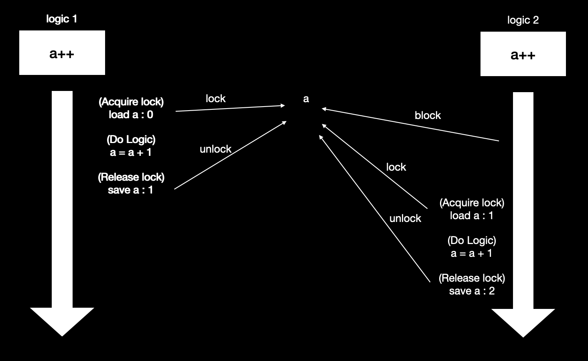

# Multi Process / thread 동기화 문제 해결

## 동기화 문제

> 서로 다른 process 및 thread가 메모리 영역을 공유하기 때문에 여러 thread가 동일한 자원에 동시에 접근해 
>
> 엉뚱한 값을 읽거나 수정하는 문제를 말한다. 

예를 들어 값을 조회하여 값을 증가 혹은 감소시키는 로직이 있다고 가정해 보자. 

1. logic 1이 a 값을 불러 읽어 들임 a  = 0
2. logic 1이 값 증가 로직 실행 a = 1 (아직 저장은 하지 않은 상황)
3. logic 2가 a 값을 불러 읽어 들임 a = 0
4. logic 2가 a 값 증가 로직 실행 a = 1 (아직 저장은 하지 않은 상황)
5. logic 2가 a 값 저장 a = 1
6. logic 1이 a 값 저장 a = 1

두번의 a++ 증가 로직이 추가되었기 때문에 우리가 기대하는 a는 2. 하지만 logic1이 완료되기 전에 logic2가 

실행이 되어 a는 1. 이러한 문제를 동기화 문제라고 하며 이를 해결 해야 한다.

## 임계영역(Critical section)

> 둘 이상의 process / thread가 동시에 동일한 자원에 접근할 수 있는 코드 부분을 의미한다.

동기화 문제를 해결하기 위해서는 하나의 process 혹은 thread가 임계구역에서 로직을 수행하는 동안에는 

다른 process 및 thread는 접근을 할 수 없도록 제어를 해야한다. 

즉 임계영역 내의 코드는 원자적으로 실행이 되어야 한다. 

대표적인 동기화 방법으로 Mutex, Semaphore가 있다.

## 동기화 방법

### Mutex

mutual exclusion의 약자로 공유자원에 접근 할 수 있는 process 및 thread의 개수를 1개로 제한한다. 

mutual lock을 통해 임계 영역을 보호합니다.

process / thread는 임계영역에 진입 전에 lock을 획득해야 하고, 임계 구역을 빠져 나올 때에는 lock을 반환 해야 함.

Mutex의 경우 단 하나의 logic만 수행되어 다른 process 및 thread 들이 효율적으로 CPU를 사용하지 못한다는 단점이 존재.

### Semaphore

동기화 방법 중 하나로 공유 자원에 접근 할 수 있는 process 및 thread의 개수가 2개 이상이 될 수 있다.

Semaphore 변수인 S에 동시에 접근 가능한 process 및 thread 수를 저장한다. 

S가 0보다 크면 임계영역으로 들어갈 수 있고, 임계영역에 들어가면 S 값을 1 줄인다. 

S값이 0이 되는 경우 다른 process 및 thread는 접근 할 수 없다.