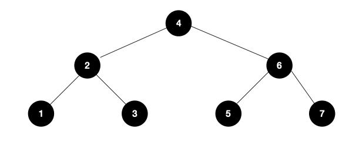

# [CS] 자료구조에 대해서

> 여러가지 자료구조에 대해서 알아보려고 한다.

## Array

Array는 data를 미리 할당된 크기만큼 메모리상에 연속적이며 순차적으로 저장하는 자료구조이다.

Array의 특징

* 고정된 저장 공간 
* 순차적인 데이터 저장
* lookup 과 append가 빠르다.

## Dynamic Array

초기에 선언한 Array의 size보다 많은 갯수의 data가 추가될 때 resize를 하여 유동적으로 size를 조절해 데이터를 저장하는 자료구조 이다.

resizing 하는 방식은 여러가지가 있지만 그 중 Doubling에 대해서만 간단히 알아보자.

[Doubling]

데이터를 추가하다가 메모리를 초과하게 되면 기존 Array의 size보다 두배 큰 배열을 선언하고 데이터를 일일히 옮기는 방식

## LinkedList

Linked List는 Node 라는 구조체로 이루어져 있다. 

Node는 Node의 value와 다음 Node의 address를 저장한다.  

물리적인 메모리상에서는 비연속적으로 저장이 되지만, Linked List의 Node가 다음 Node의 address를 가르킴으로써 논리적인 연속성을 가지는 자료구조이다.

## Array vs LinkedList

Linked List를 사용하는 것이 유리한 경우 

* O(1) 으로 삽입/삭제를 자주 해야 될 때
* 얼마만큼의 데이터가 들어오는지 예측을 할 수 없을 때 
* 조회 작업을 별로 하지 않을 때

Array를 사용하는 것이 유리한 경우 

* 조회 작업을 자주 해야될 때 
* 데이터 개수를 미리 알고 있을 때 

## Queue 

* Queue는 FIFO(First In First Out)의 자료구조
* enqueue : O(1), dequeue : O(1)
* Cache 구현, 프로세스 관리, BFS에 사용된다. 

## Stack

* Stack은 LIFO(Last In First Out)의 자료구조
* push : O(1), pop : O(1)
* 괄호 유효성 검사, 웹 브라우저 방문기록, DFS에 사용된다.

## BST

* Binary Search Tree(이진 탐색 트리) 의 약자로 정렬된 tree 이다.
* 모든 노드에 대해
  * right subtree 에는 해당 노드보다 큰 값들을 지닌 노드로만 구성 되어 있다.
  * left subtree 에는 해당 노드보다 작은 값들을 지닌 노드로만 구성 되어 있다.
* 검색, 저장, 삭제 : O(logn)
  *  worst case: O(n) -> 한쪽으로 치우친 tree가 되었을 때 

## Hash table 

* hash table은 빠른 탐색을 위한 자료구조로 `key-value`쌍의 데이터를 입력받는다. 

* hash function h에 key를 넣어 얻은 Hash Value h(key)를 위치로 지정해 Key-value 데이터 쌍을 저장한다.

* 저장, 삭제, 검색의 시간 복잡도는 O(1), 
  * worst case : O(n) -> 모든 h(key) 값이 collision이 일어날 경우 

### Collision

서로 다른 key의 hash value가 같을 때를 말한다.

최대한 collision이 적게 일어나도록 hash function을 잘 설계해야 하고, 어쩔 수 없이 collision이 일어나는 경우 

`seperate chaining`, `open addressing` 방법을 사용할 수 있다.

[Open Addressing]

* Collision이 발생할 경우 미리 정해놓은 규칙에 따라 hash table의 비어있는 slot을 찾는 방식
* Separate chaining q방식에 비해 메모리를 적게 사용한다.
* 찾는 방식에 따라 Linear Probing, Quadratic Probing, Double Hashing 으로 나뉜다.
* [Linear Probing]
  * 충돌이 발생한 해시값 부터 일정한 값만큼 이동하여 비어 있는 slot에 데이터를 저장한다.
  * (+1 , +2, +3 ...)
* [Quadratic Probing]
  * 충돌이 발생한 해시값 부터 일정한 값만큼 이동하여 비어 있는 slot에 데이터를 저장한다.
  * (+1 , +4, +9 ...)
* [Double Hashing]
  * Linear Probing과 Quadratic Probing은 충돌횟수가 많아지면 특정 영역에 데이터가 몰리는 클러스터링 현상이 발생한다.
  * 이를 해결하기 위해 Double Hashing은 두가지의 해시함수를 사용한다. 
    * 한가지는 해시 값을 얻을 때 사용
    * 다른 한가지는 Collision이 발생했을 때 이동 폭을 얻기 위해 사용합니다.

[Seperate chaining]

* Collision이 발생할경우 linked list (혹은 Tree)를 사용해 문제를 해결하는 방식