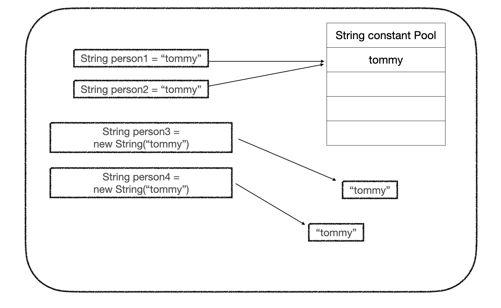

# [JAVA] ==과 equals()의 차이점

>  그동안 Spring을 사용 해 진행하면서 `==` 과 `equals()`의 큰 차이점을 모르는 채로 equals() 만 사용을 해왔었다.
>
>  이 부분에 대해 정확히 개념을 잡아보려고 한다.


# String 변수 생성

String 변수를 생성하는 방식에는 두가지 방식이 있다.

* literal 을 이용한 방식
* new 연산자를 이용한 방식

[literal을 이용한 방식]

* `string constant pool` 이라는 영역에 존재하게 된다.

* string constant pool 에 주어진 문자열이 있는지 검색한다.
  * 문자열이 있으면 해당 주소값을 반환
  * 문자열이 없으면 string constant pool에 넣고 새로운 주소값을 반환

[new 연산자를 이용한 방식]

* Heap 영역에 존재한다.




# == 와 equals()

[==]

== 연산자는 비교하고자 하는 두개의 대상의 **주소값**을 비교한다.

[equals()]

equals() 연산자는 비교하고자 하는 대상의 **값 자체**를 비교한다. 


코드로 알아보자

[Test Code]

```java
@Test
    void equals() {
        String person1 = "tommy";
        String person2 = "tommy";
        String person3 = new String("tommy");
        String person4 = new String("tommy");

        // literal & literal 비교
        System.out.println("literal & literal 비교");
        System.out.println("person1, person2 '==' = " + (person1 == person2));
        System.out.println("person1, person2 'equals' = " + person1.equals(person2));

        // literal & String 비교
        System.out.println("literal & String 비교");
        System.out.println("person1, person3 '==' = " + (person1 == person3));
        System.out.println("person1, person3 'equals' = " + person1.equals(person3));

        // String & String 비교
        System.out.println("String & String 비교");
        System.out.println("person3, person4 '==' = " + (person3 == person4));
        System.out.println("person3, person4 'equals' = " + person3.equals(person4));

    }
```

[Test Result]

```ruby
literal & literal 비교
person1, person2 '==' = true
person1, person2 'equals' = true

literal & String 비교
person1, person3 '==' = false
person1, person3 'equals' = true

String & String 비교
person3, person4 '==' = false
person3, person4 'equals' = true
```

`person1`,` person2` 는 literal으로, `person3`과 `person4`는 String으로 생성했다. 

[literal & literal]

* literal은 주소, 값이 같다.
  * == : true
  * equals() : true

[literal & String] 

* literal 과 String은 주소는 다르고 값은 같다.
  * == : false
  * equals() : true

[String & String]

* String 과 String은 주소는 다르고 값은 같다.
  * == : false
  * equals() : true


>  Backend 개발을 하다보면 json 으로 들어오는 request에 대해서 검증을 하는 로직을 자주 짜게 된다. 
>
> 이럴 경우에는 == 으로 비교하는 것이 아닌 equals()로 비교하는 것이 유리하다.


