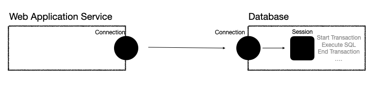

# Transaction에 대한 이해

> Database에서 Transaction내 일어난 동작들에 대해서 안전하게 처리하고 보장해준다. 

### Database를 사용하는 이유

데이터를 저장하는 방식에는 많은 방식들이 있습니다. 

e.g.) Excel, File, Database ... 

그 중 데이터베이스를 사용하는 주된 이유는 `Transaction`을 지원하기 때문입니다. 

Transaction은 말 그대로 직역하면 거래라는 의미로, 한 Transaction 내에 일어난 동작들에 대해 안전하게 처리할 것임을 보장합니다. 

### Transaction의 특징 

Transaction은 크게 4가지의 특징을 지닙니다. 

보통 앞글자를 따서 ACID 원칙이라고 부릅니다. 

- Atomicity (원자성)
  - 동일한 Transaction 내에서 일어난 작업들은 마치 하나의 작업인 것처럼 모두 실행되거나 모두 실행되지 않아야 합니다. 
- Consistency (일관성)
  - 모든 Transaction은 일관성 있는 데이터베이스 상태를 유지해야 합니다. 
- Isolation (격리성)
  - 동시에 실행되는 Transaction들이 서로에게 영향을 미치지 않도록 격리해야 합니다. 
- Durability (지속성)
  - 성공적으로 수행된 Transaction은 데이터베이스에 영구적으로 기록되어야 합니다. 

### WAS와 DB의 연결 수립 과정 

WAS가 DB와의 커넥션을 생성하면 DB는 내부적으로 Session을 생성한다.

WAS에서 실행할 쿼리를 Database로 전달하면 Database내 Connection에 할당된 Session에서 실질적인 일을 처리한다.

*만약 size가 10인 Connection Pool을 사용한다면 Database에 총 10개의 세션이 존재한다.*

### Transaction - read 

두가지의 세션(Session A, Session B)이 동일한 데이터베이스를 조회한다고 가정하자. 

[Session A]

1. autocommit = false 설정  (데이터베이스의 autocommit 설정의 기본은 true)
2. `insert into member(member_id, age) values ('President', 66);` 쿼리 실행 

이러한 경우 Session A, Session B의 데이터베이스 조회 결과를 보면  

- Session A  : ('President', 66)  존재
- Session B : 아무것도 존재하지 않음. 

**Session A가 아직 작업을 하고 커밋을 하지 않았기 때문에 Session B 에서는 데이터 조회를 했을 때 아무것도 확인할 수 없다.** 

이 다음 Session A 가 commit을 하는 경우와 rollback을 하는 상황을 나누어 확인 해 보자. 

##### Commit 실행 

[Session A]

1. commit; 실행 

이러한 경우 Session A, Session B 의 결과를 확인 하면 다음과 같다. 

- Session A  : ('President', 66)  존재
- Session B : ('President', 66)  존재

##### Rollback 실행 

[Session A]

1. rollback; 실행 

이러한 경우 Session A, Session B 의 결과를 확인 하면 다음과 같다. 

- Session A  : 아무것도 존재하지 않음.
- Session B : 아무것도 존재하지 않음.

### Transaction - update (Lock)

데이터베이스는 특정 row의 값을 변경하려고 할 때 Lock을 가지고 있어야 변경이 가능합니다. 

만약 다른 Transaction이 Lock을 선점 했다면 Lock을 풀어줄 때 까지 기다리다가 Lock을 획득하면 update를 실행합니다. 

> 이때 Lock의 대기시간을 지정할 수 있습니다. 
>
> 만약 허용된 대기시간을 초과하게 되면 예외가 발생하며 update query가 실행되지 않습니다. 