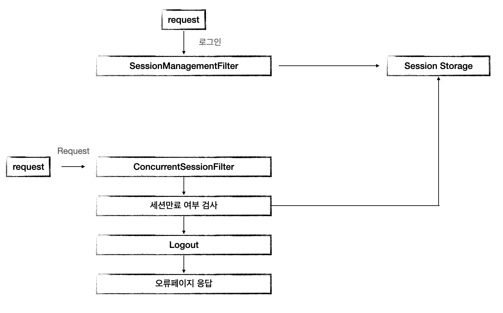

# SessionManagementFilter

> SessionManagementFilter는 크게 다음 기능들을 제공한다. 
>
> 1. 세션 관리
> 2. 동시적 세션 제어
> 3. 세션 고정 보호 
> 4. 세션 생성 정책
>
> 추가적으로 SessionManagementFilter는 ConcurrentSessionFilter과 함께 작동한다. 

## 동시적 세션 제어

최대 세션 허용 개수를 초과할 경우 두가지의 방식을 고려할 수 있다. 

##### 이전 사용자 세션 만료

> 기존 사용자가 로그인한 상태에서 만약 새로운 사용자가 로그인을 시도 했을 때 
>
>  새로운 사용자에게 세션을 생성해주며 기존에 로그인 한 사용자는 세션이 만료되는 방식

##### 현재 사용자 인증 실패

> 기존 사용자가 로그인한 상태에서 만약 새로운 사용자가 로그인을 시도 했을 때 
>
> 새로운 사용자에게 인증 예외 발생을 처리해주는 방식

## 세션 고정 보호 

해커가 악의적인 용도로 Session Fixation Attack을 하려고 할 때 방지할 수 있는 대비책이다. 

위의 그림은 Session Fixation의 예시이다. 

해커가 서버에 접속해 JSESSIONID를 발급한 후 해킹하고자 하는 유저의 컴퓨터에 JSESSIONID를 심어놓았을 때, 

유저가 로그인을 한다면, 해커는 자신의 JSESSIONID를 통해 해킹하고자하는 유저의 정보를 공유할 수 있다. 

이러한 해킹 방법을 막고자 나타난 방법이 세션 고정 보호 방식이다. 

`세션 고정 보호 방식`은 별표쳐진 부분에서 동작한다. 

유저가 로그인 시 마다 새로운 쿠키를 발급해준다면, 해커가 심어놓은 JSESSION은 지난 세션이기 때문에 로그인이 불가능하다. 

이러한 방식을 통해 Session Fixation을 막을 수 있다. 

## 세션 정책 

> 세션 정책에는 총 4가지가 존재한다. 

###### ALWAYS

=> 스프링 시큐리티가 항상 생성

###### If_Required

=> 스프링 시큐리티가 필요 시 생성

###### Never

=> 스프링 시큐리티가 생성하지 않지만 이미 존재하면 사용

###### Stateless

=> 스프링 시큐리티가 생성하지 않고, 존재해도 사용하지 않음

## 동작 과정

기존의 사용자가 로그인을 한 상태에서 새로운 사용자가 로그인을 하는 경우 SessionManagementFilter는 Session Storage를 검사한다.

만약 `기존 사용자 세션 만료`라면 기존의 사용자 Session을 만료시킨다.

그 후로 기존의 사용자가 HTTP request를 하게 된다면 ConcurrentSessionFilter를 거쳐간다. 

기존 사용자의 세션의 만료여부를 검사한 후 만료되었다면, 로그아웃 처리와 오류페이지 응답을 내린다. 